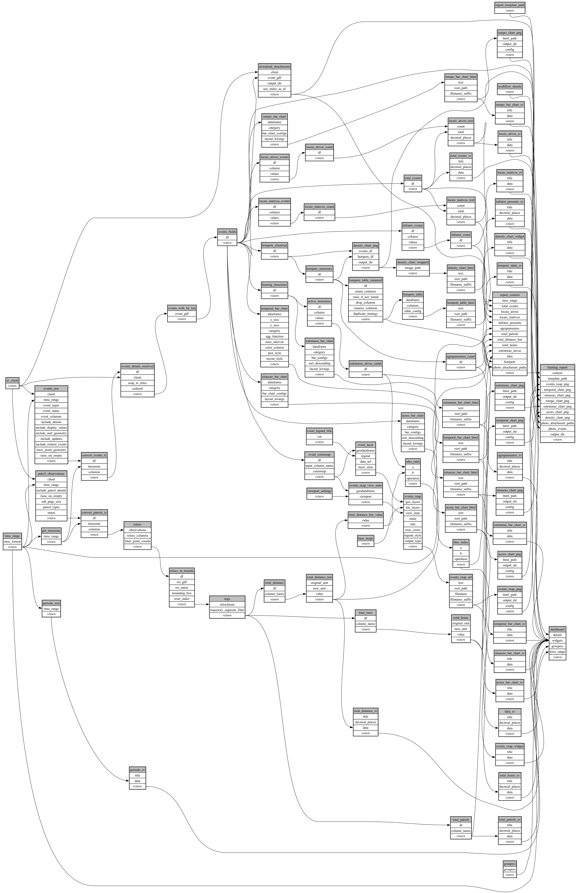

```
# AUTOGENERATED BY ECOSCOPE-WORKFLOWS; see fingerprint in README.md for details

```

```yaml
# fingerprint:
artifacts_sha256_basic: 286b7c8246c809f938c19b9c6fa06277a53c89e3009e4eb31044ba8b773bdcf5
artifacts_sha256_strict: 1611e4585fc65e87298f39329e628057d5599741bc7e32dbfca0dbb5e9f7b457
installed_requirements:
- channel: https://repo.prefix.dev/ecoscope-workflows/
  name: ecoscope-platform
  version: {version: ==2.25.1}
- channel: https://repo.prefix.dev/ecoscope-workflows-custom/
  name: ecoscope-workflows-ext-custom
  version: {version: ==0.1.1}
- channel: conda-forge
  name: pydeck
  version: {version: ==0.9.2}
- channel: file:///tmp/ecoscope-workflows-custom/release/artifacts/
  name: ecoscope-workflows-ext-icmbio
  version: {version: ==0.0.6}
params_sha256: dcbcccfeae5ebd3c05559fbf4f363c328014357fef2ced8ad8ca574699c8c90f
spec_sha256: d71967f3f357017bbe6622f3b8c25197151d265045c46fa36b603f9c6d9ed7b1

```

# ecoscope-workflows-hunting-intelligence-workflow


